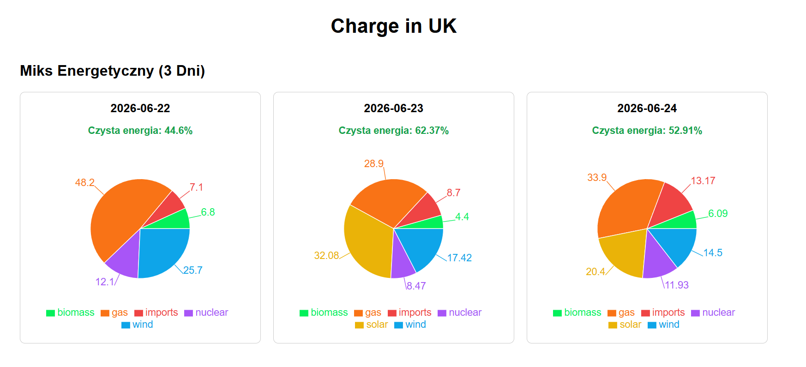
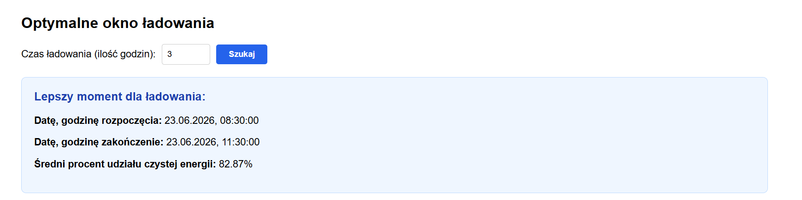

# Test-Task-Spyrosoft-Frontend

---

**EV Smart Charge UK - Frontend (React + TypeScript)**

---

* User interface for an application that analyzes the UK's energy mix and determines the optimal time window for charging electric vehicles (EVs).
* Backend Repository (Spring Boot): https://github.com/rakets/Test-Task-Spyrosoft

---

## 📑 Table of Contents
* [Tech Stack](#-tech-stack)
* [How to Run the Project](#-how-to-run-the-project)
* [Screenshots](#-screenshots)

---

## 🏗 Tech Stack

* **React 18**
* **TypeScript**
* **Vite**

---

## 🚀 How to Run the Project

1.  **Clone the repository:**
    ```bash
    git clone https://github.com/rakets/Test-Task-Spyrosoft-Frontend.git
    ```
2.  **Go to the project folder:**
    ```bash
    cd Test-Task-Spyrosoft-Frontend
    ```
3.  **Install all required dependencies:**
    ```bash
    npm install
    ```
6.  **Start the development server:**
    ```bash
    npm run dev
    ```
  <p> Server will be available at `http://localhost:5173`.</p>
  <p> For the application to fully work locally, you must also run the Backend project on port 8080.</p>
    
---

## 📸 Screenshots

<p align="center">
  
</p>

---

<p align="center">
  
</p>

---
